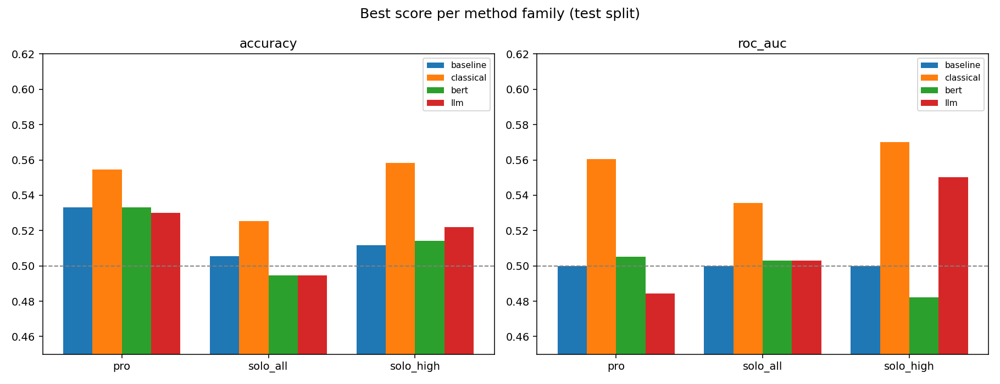
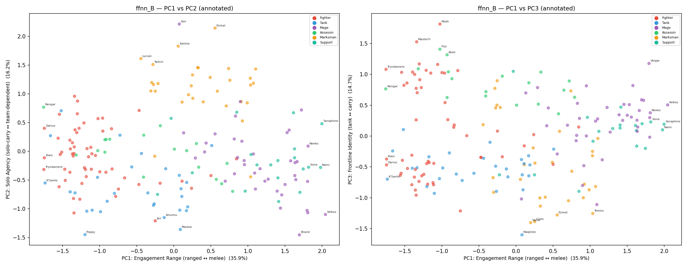
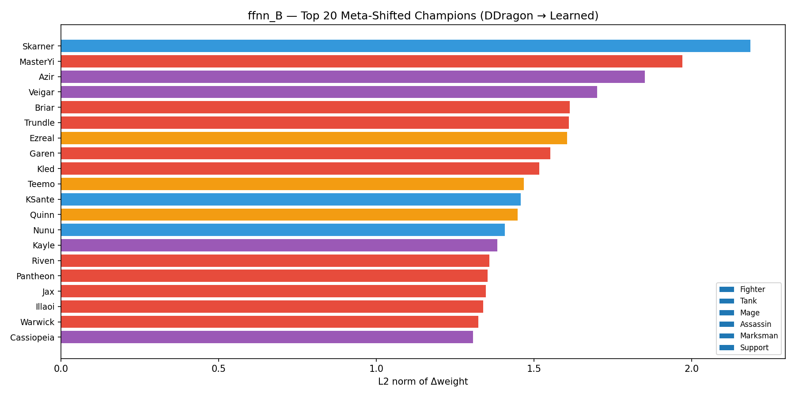

# Win Prediction and Champion-Embedding Interpretation of League of Legends Drafts
### A Weak but Interpretable Signal — Benchmarking Traditional ML vs. LLMs and Reading the Learned Embedding Space

**Team LOL CHANG** — Seonghyun Lee (22631006), Yunseong Choi (22631009)

---

## Abstract

We study a deliberately constrained question: given **only the ten drafted champions** of a
League of Legends match — no in-game statistics, no player identities — how much of the
outcome is recoverable, and what does a model trained on that signal learn about champions?
We run two complementary studies on the same datasets and champion encoder. **Study 1 (a
prediction benchmark)** compares traditional machine learning (16 classifiers over four
draft representations, interpreted with SHAP) against large-language-model knowledge (a
fine-tuned BERT and a zero-shot Qwen3-32B). **Study 2 (an embedding interpretation)** trains
feed-forward and convolutional draft-to-win models, then reads back the learned 32-dimensional
champion embedding via t-SNE, KMeans archetypes, weight-shift, and PCA. The two studies agree
on a single conclusion: **champion composition is a weak determinant of match outcome** (best
AUC 0.54–0.57; LLM general knowledge sits at chance and is over-confident), **but the learned
embedding is interpretable** — it recovers an unstated range mechanic, exposes which champions
have drifted from their designed role, and reveals a fundamental high- vs. low-tier difference
in what a "good draft" means.

---

## 1. Introduction

In League of Legends, two teams of five **draft** champions before a match begins. Conventional
wisdom holds that the draft carries meaningful win-rate information — counters, synergies,
scaling. This project tests how much of the final outcome is actually recoverable from the
draft alone, isolating champion choice from the dominant confounds of individual skill and
in-game execution, and then asks what a win-prediction model *learns* in the process.

We treat the win-prediction task as a **probe** and apply a range of deep-learning concepts to
it: learned champion **embeddings**, a **1-D CNN** over the draft sequence, **BERT fine-tuning**
on verbalised drafts, **zero-shot prompting** of a 32B LLM, **transfer learning** between
datasets, and post-hoc interpretation with **SHAP**, **PCA**, **t-SNE** and **UMAP**. The work
is organised as two studies:

- **Study 1 — Prediction benchmark** ([`prediction-benchmark/`](prediction-benchmark/)):
  *how well* can the winner be predicted, and does an LLM's general knowledge help?
- **Study 2 — Embedding interpretation** ([`embedding-analysis/`](embedding-analysis/)):
  *what* does the model learn about champions when trained on draft outcomes?

The contribution is an honest, reproducible answer with a quantified ceiling, plus
interpretable and visual evidence for *why* the ceiling is low and *what structure* the
embedding nonetheless captures.

## 2. Related Work

Outcome prediction in League of Legends is a mature research area. On the **pre-game** side, Do
et al. (2021) train a deep neural network on **player-champion experience** and reach 75.1%
accuracy, showing that proficiency with the *specific* drafted champion — not composition per
se — drives the result. Chowdhury et al. (2025) combine pre-game features (player experience,
role, a novel "streak" feature) with **in-game** data on a rank-representative dataset and reach
76.8%, and they survey further work that adds champion-**synergy** relations as features (e.g.
Hitar-García et al.).

Champion **embeddings** are also established. Chen et al. (2018) learn synergy/opposition
embeddings (a word2vec-style latent model) and use them for match prediction and pick
recommendation, validating that the space aligns with experienced players' intuitions;
avinot244's *Champions-Corpus* builds LLaMA-based embeddings from champion **descriptions** via
triplet loss for downstream use. In both cases the embedding is a *means* to a task
(prediction, recommendation, similarity).

**Our work differs in object and design.** (i) We learn the embedding from draft win/loss
**alone** and treat the **space itself** as the object of analysis — its principal axes, its
**drift from designer metadata** (Δweight against DDragon), and an unstated mechanic
(`attackrange`, r = +0.82) that it recovers without ever receiving it as input. (ii) We
**compare the learned representation across player-population distributions** — professional vs.
solo-rank, and across tiers — a design absent from prior work, which reports one accuracy or a
single embedding per dataset. Because raw win/loss prediction is largely saturated (the studies
above converge at ~75–77% once player- and in-game signal is included), we shift the question
from *"what predicts the winner"* to *"what a draft-trained model learns about champions, and how
that differs across player populations."*

## 3. Data

Both studies share label-encoded datasets and one champion `label_encoder` (**192 champion ids,
171 actually observed**). Each row is `blue_p1..5`, `red_p1..5` (encoded champion ids) and
`result` (1 = blue win). Exact-draft duplicates are negligible, so memorisation is impossible
and only generalisation is measured.

| Dataset | Matches | Blue win-rate | Environment | Used by |
|---|---|---|---|---|
| `pro` | 10,008 | 0.533 | Professional esports (Oracle's Elixir 2025), 24 patches | Study 1 & 2 |
| `solo_all` | 137,146 | 0.494 | Solo queue, all tiers | Study 1 & 2 |
| `solo_high` | 2,566 | 0.513 | Solo queue, GM + Challenger | Study 1 & 2 |
| `solo_low` | 13,984 | — | Solo queue, Iron–Silver | Study 2 only |

**Auxiliary assets (DDragon 15.19.1).** Champion metadata `champion.json` (six role tags, four
info ratings, seven base stats) and a pretrained 32-d champion embedding `embedding_init.pt`,
built from a 17-dimensional feature matrix `[tags one-hot (6) | info ÷10 (4) | stats min-max
(7)]`. Notably `attackrange` is **excluded** from this matrix — a fact that becomes central in
§6.2.

## 4. Task and Method

### 4.1 Shared task
Binary classification of `result` (blue win vs. not) from the ten champion ids alone.

### 4.2 Study 1 — Prediction benchmark
Splits are **stratified 70/15/15** (fixed seed) so every method is evaluated on identical test
rows.

- **Four draft representations:** `bag` (length-192 signed multi-hot, +1 blue / −1 red;
  *primary*), `meta` (team-aggregated DDragon metadata, 51-d), `emb` (team-mean of pretrained
  embeddings, 96-d), `combo` (all three, 339-d).
- **16 classifiers** spanning linear, distance, probabilistic, tree-ensemble (incl. XGBoost,
  LightGBM) and neural (MLP) families, plus majority-class / blue-prior baselines.
- **SHAP** (TreeExplainer on XGBoost + `bag`): because each feature *is* a champion, a SHAP
  value is that champion's signed contribution to the blue-win probability.
- **LLM knowledge:** **BERT** (`bert-base-uncased`) fine-tuned on drafts verbalised as
  `"Blue team: … . Red team: … ."`; **Qwen3-32B** prompted **zero-shot** (no training) for the
  winning side, scored by the probability mass on the "Blue"/"Red" answer token.

### 4.3 Study 2 — Embedding interpretation
A `(192, 32)` champion embedding, initialised from the DDragon projection and trained with
`requires_grad=True`, under two architectures:

- **FFNN** (~105K params): embed all ten picks, **concatenate** (320-d), MLP → sigmoid.
  Pick-slot order is ignored.
- **1-D CNN** (~23K params): treat the ten picks as a `(32, 10)` sequence,
  `Conv1d→Conv1d→AdaptiveAvgPool` → sigmoid. Captures local adjacency.

Training: Adam (1e-3), BCELoss, ≤30 epochs, early stopping (patience 5), 80/20 split (seed 42),
with **blue/red swap augmentation** (mirror every `(blue,red,win)` to `(red,blue,loss)`) to
remove side bias. The learned embedding is then analysed with **t-SNE** (before/after, role-
coloured), **KMeans archetypes** (k=7 over mean-pooled 5-picks), **Δweight**
(`‖W_after−W_before‖₂` per champion), and **PCA** (axes correlated against DDragon stats). A
**transfer-learning** variant re-initialises the data-poor A/C/D from Model B's learned
embedding.

## 5. Experiments

| | Study 1 (prediction-benchmark) | Study 2 (embedding-analysis) |
|---|---|---|
| Goal | how well can we predict | what does the model learn |
| Models | 16 ML + BERT + Qwen3-32B | FFNN + 1-D CNN (+ transfer) |
| Split | stratified 70/15/15 (test reported) | 80/20 train/val |
| Interpretation | SHAP, UMAP | t-SNE, archetypes, Δweight, PCA |
| Datasets | pro, solo_all, solo_high | + solo_low (A/B/C/D) |

Reproduction commands are in each sub-project's README; full write-ups are in
[`prediction-benchmark/docs/PAPER.md`](prediction-benchmark/docs/PAPER.md) and
[`embedding-analysis/docs/PAPER.md`](embedding-analysis/docs/PAPER.md).

## 6. Result Analysis

### 6.1 Study 1 — the draft is a weak, low-signal predictor

| Dataset | Method | Acc | AUC | LogLoss |
|---|---|---|---|---|
| pro | **Traditional best (ExtraTrees + bag)** | 0.555 | **0.561** | 0.686 |
| pro | BERT (fine-tuned) | 0.533 | 0.505 | 0.691 |
| pro | Qwen3-32B (zero-shot) | 0.530 | 0.484 | 1.049 |
| solo_all | **Traditional best (LogReg + combo)** | 0.525 | **0.536** | 0.691 |
| solo_all | BERT (fine-tuned) | 0.495 | 0.503 | 0.693 |
| solo_all | Qwen3-32B (zero-shot) | 0.495 | 0.503 | 1.156 |
| solo_high | **Traditional best (LogReg + combo)** | 0.558 | **0.570** | 0.722 |
| solo_high | Qwen3-32B (zero-shot) | 0.522 | 0.550 | 1.121 |

- **Across 16 classifiers and 4 representations, AUC never exceeds ~0.57.** All model families
  land in a narrow 0.524–0.536 band on `solo_all`: the ceiling is a property of the *task*, not
  the model.
- **Structure beats text.** The `bag` one-hot consistently outperforms feeding champion *names*
  to BERT, which barely leaves the majority class (AUC ≈ 0.50).
- **LLM general knowledge ≠ meta knowledge.** Qwen3-32B zero-shot ranks at chance and is badly
  mis-calibrated (log-loss ≈ 1.1 vs. ≈ 0.69 for a calibrated coin); on `pro` it is even below
  chance (AUC 0.484), consistent with professional drafts being deliberately balanced.
- **SHAP** shows the small exploitable signal is side bias plus a short list of strong/weak
  champions (e.g. Zac, Kha'Zix, Darius for `pro`; Azir, K'Sante, Singed for `solo_all`).



### 6.2 Study 2 — the embedding is weak at prediction but rich in structure

Validation accuracy mirrors Study 1 (all ~51–53%), and **FFNN ≈ CNN** everywhere (< 0.003 val
loss): pick-slot order p1…p5 carries no win signal — in a draft *who* is present matters, not
*where*. Swap augmentation removed side bias and lifted the smallest set (**Model C 49.6% →
52.7%**).

| Model | Rows | FFNN val acc | CNN val acc |
|---|---|---|---|
| A pro | 10,008 | 53.1% | 52.8% |
| B solo_all | 137,146 | **53.2%** | 53.1% |
| C solo_high | 2,566 | 52.7% | 51.4% |
| D solo_low | 13,984 | 51.8% | 51.3% |

Despite the flat accuracy, the **learned embedding is interpretable**, and only **Model B (137K,
all tiers)** has enough data *and* draft diversity to escape its DDragon initialisation:

- **PCA latent axes.** PC1 (37–46% variance) = **engagement range**, correlating r = **+0.82**
  with `attackrange` — a feature that was **never an input**; the model recovered an unstated
  game mechanic from win/loss patterns. PC2 (16–18%) = **solo agency** (solo-kill vs.
  team-dependent), with no DDragon correlate — a purely data-learned axis. PC3 (13–15%) =
  **frontline identity** (tank vs. self-sufficient carry).
- **Meta drift (Δweight).** Only B deviates meaningfully (~1.3 vs. ~0.08), and its top movers —
  **Azir (1.75), K'Sante (1.60), Skarner (1.57)** — are exactly the champions whose *played* role
  diverged from their *designed* one around patch 25.19.
- **Tier philosophy (archetypes).** Challenger (C) drafts concentrate on assassin-divers
  (individual skill expression); Iron–Silver (D) converges on utility champions (executional
  stability) — the definition of a "good draft" is tier-dependent.
- **Transfer learning depends on domain distance**, not target scarcity: B→D **improves +2.8%p**,
  B→C **degrades −3.5%p** (all-tier average dilutes Challenger's extreme meta), B→A is neutral.

<p align="center">
  
  
</p>

### 6.3 Cross-study agreement
Both studies independently reach the same headline: **draft alone ≈ a coin flip for the
outcome**, yet **champion identity is a real, interpretable structure** — discrete champion
encodings (Study 1's `bag`, Study 2's embedding) carry what little signal exists, while LLM
*names-as-text* and *general knowledge* do not.

## 7. Conclusion

Predicting a League of Legends match from its draft alone is close to a coin flip: sixteen
traditional models converge on AUC ≈ 0.54–0.57, a fine-tuned text model gains nothing over the
prior, and a 32B language model's general knowledge performs at chance while being
over-confident. Yet the **embedding** a win-prediction model learns is legible — it separates
champions by engagement range and solo agency, recovers an unstated range mechanic, flags
champions whose meta identity has drifted from their design, and exposes a fundamental high-
vs. low-tier difference in what a draft is *for*. The honest takeaway: **champion composition
is a minor but interpretable nudge on win probability — not a predictor — and off-the-shelf LLM
knowledge does not substitute for data-grounded modelling of the live meta.**

## 8. Repository Structure

```
.
├── README.md                 this submission write-up
├── embedding-analysis/       Study 2 — learned-embedding interpretation (data producer)
│   ├── src/ outputs/ data/ weights/
│   └── docs/PAPER.md
└── prediction-benchmark/     Study 1 — ML vs. LLM prediction benchmark (data consumer)
    ├── src/ figures/ results/
    └── docs/PAPER.md
```

## 9. References

**Prior work**
- Chen, Z., Xu, Y., Nguyen, T.-H. D., Sun, Y., & Seif El-Nasr, M. (2018). *Modeling Game Avatar
  Synergy and Opposition through Embedding in Multiplayer Online Battle Arena Games.*
  arXiv:1803.10402.
- Do, T. D., Wang, S. I., Yu, D. S., McMillian, M. G., & McMahan, R. P. (2021). *Using Machine
  Learning to Predict Game Outcomes Based on Player-Champion Experience in League of Legends.*
  FDG '21. arXiv:2108.02799.
- Chowdhury, S., Ahsan, M., & Barraclough, P. (2025). *Applications of Linear and Ensemble-Based
  Machine Learning for Predicting Winning Teams in League of Legends.* Applied Sciences, 15(10),
  5241. https://doi.org/10.3390/app15105241.
- avinot244. *League-of-Legends-Champions-Corpus* (LLaMA-based champion embeddings via triplet
  loss). GitHub. https://github.com/avinot244/League-of-Legends-Champions-Corpus.

**Data**
- Oracle's Elixir, *2025 LoL Esports Match Data* (https://oracleselixir.com); Nathan Smallcalder,
  *League of Legends Matches, Patch 25.19+* (Kaggle); Riot Games **Data Dragon** 15.19.1
  (https://ddragon.leagueoflegends.com/cdn/15.19.1/data/en_US/champion.json).

**Models / tooling**
- `bert-base-uncased`; **Qwen3-32B**; scikit-learn; **XGBoost**; **LightGBM**; PyTorch;
  **SHAP** (Lundberg & Lee, 2017); **UMAP** (McInnes et al., 2018); t-SNE (van der Maaten &
  Hinton, 2008).

**Detailed write-ups**
- [`embedding-analysis/docs/PAPER.md`](embedding-analysis/docs/PAPER.md),
  [`prediction-benchmark/docs/PAPER.md`](prediction-benchmark/docs/PAPER.md).
