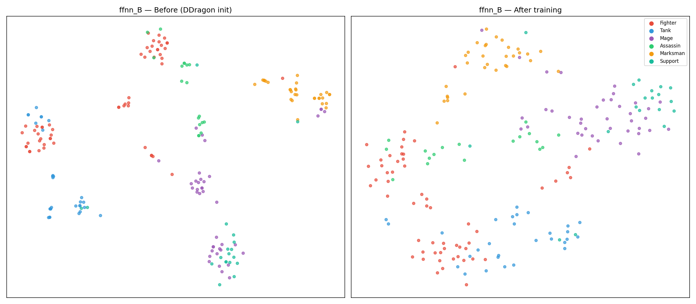
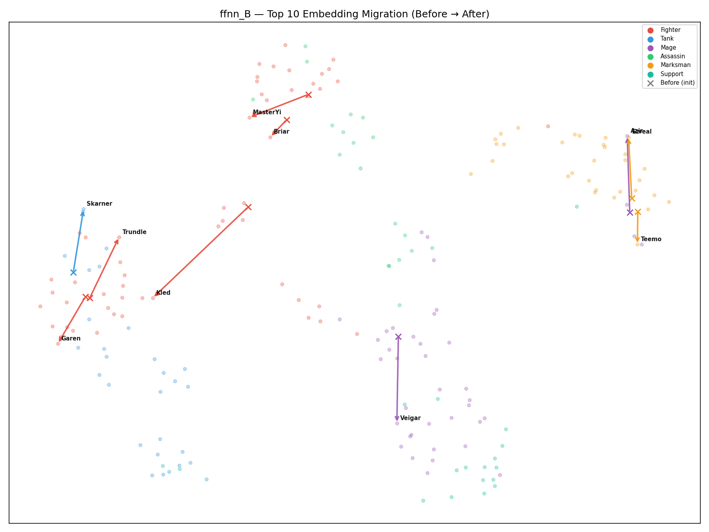
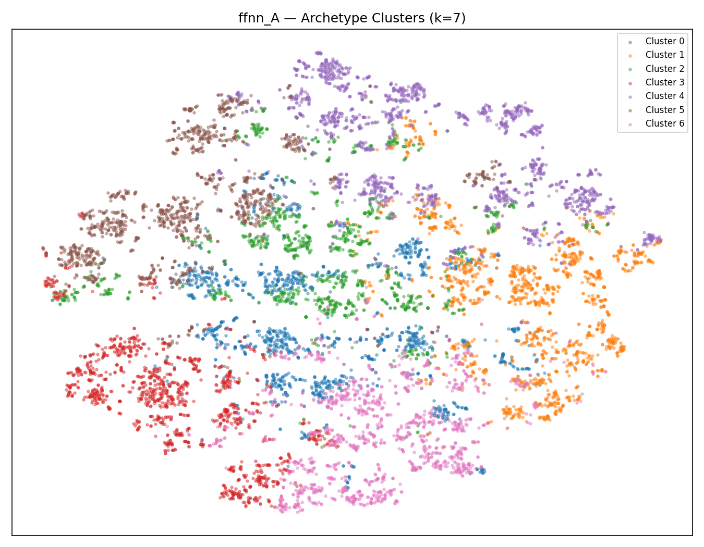
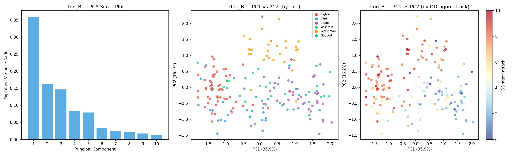

# Embedding Analysis Report — DraftEmbedding (FFNN & CNN)

## 개요

네 모델(A: 프로, B: 솔로랭크 전체, C: 솔로랭크 고티어, D: 솔로랭크 저티어)을
두 아키텍처(FFNN, 1D-CNN)로 학습하여 총 8개 모델의 챔피언 임베딩을 분석하였다.
모든 학습에는 **Blue/Red swap augmentation**을 적용하여 side bias를 제거하였다.

실험 설계, 데이터 파이프라인, 아키텍처 상세는 [experiment_design.md](experiment_design.md) 참조.

---

## 정확도에 대한 맥락

전체 모델의 val_acc가 51~53% 수준이다. 이를 "거의 랜덤"으로 오독하지 않기 위해
다음 맥락을 명시한다.

**드래프트 정보만으로 승패를 예측하는 것은 본질적으로 어려운 문제이다.**
LoL 경기의 승패는 개인 실력, 인게임 의사결정, 팀 커뮤니케이션 등 드래프트 외 변수가 지배한다.
선행 연구에서도 드래프트만의 예측 정확도는 55% 내외가 상한으로 보고되며,
이는 스포츠 분석에서 "라인업만으로 승패 예측"과 동일한 구조적 한계이다.

따라서 본 프로젝트의 목적은 **높은 예측 정확도가 아니라,
학습 과정에서 형성된 임베딩 공간의 구조를 해석**하는 데 있다.
53%의 정확도라도 임베딩이 의미 있는 구조를 학습했다면,
이는 드래프트가 승패에 기여하는 **방향성**을 포착한 것이다.
그리고 이 구조는 아래 분석에서 일관되게 확인된다.

---

## 1. t-SNE 클러스터 (Before/After)

### 관찰

- **Before (DDragon init)**: 모든 모델이 동일한 초기화에서 출발.
  DDragon tag·info·stats 17차원의 Xavier 투영. 역할 기반 클러스터가 이미 존재.
  - Marksman/Support 클러스터가 가장 선명, Fighter/Tank은 겹침

- **After**:
  - **FFNN B / CNN B (솔로 전체, 137K)**: 클러스터 경계 흐려짐. Fighter-Assassin-Mage 혼합.
  - **FFNN A / CNN A (프로, 10K)**: DDragon 구조 대체로 유지. CNN이 FFNN보다 약간 더 변형
    (7 epoch vs 1 epoch).
  - **FFNN D / CNN D (저티어, 14K)**: Lux, Teemo, MissFortune 등 저티어 인기 챔피언 주변 밀집도 증가.
  - **C (고티어, 2.5K)**: DDragon 초기화 지배적.

### 해석

t-SNE가 보여주는 것은 **"DDragon이 정의한 역할 분류가 실제 게임에서 얼마나 유효한가"**이다.

Before 플롯에서 Marksman과 Support이 가장 선명하게 분리되는 이유는,
이 두 역할의 DDragon stat 프로필이 극단적으로 다르기 때문이다 (사거리, 방어력, 공격력 등).
반면 Fighter/Tank의 혼합은 DDragon의 stat 기반 분류가 이 두 역할을 구별하기에 불충분함을 드러낸다.

After(B)에서 클러스터가 재편되는 현상은 **역할 태그보다 실제 기능적 유사성이 임베딩을 지배**하게
되었음을 의미한다. 예컨대, DDragon에서 "Mage"로 분류된 Swain이 학습 후 Tank/Fighter 쪽으로
이동했다면, 이는 솔로랭크에서 Swain이 마법사보다 탱키한 브루저로 운용되고 있다는 메타 반영이다.

A(프로, 10K)에서 구조가 유지되는 것은 데이터 부족도 있지만, **프로 메타 자체가 DDragon 역할 분류와
크게 어긋나지 않기 때문**이기도 하다 — 프로에서는 챔피언을 설계 의도에 가깝게 운용하는 경향이 있다.
C(고티어, 2.5K)는 데이터 부족이 지배적 원인이다. 반면 D(저티어, 14K)는 A보다 데이터가 많음에도
변형이 제한적인데, 이는 저티어 드래프트가 소수의 인기 챔피언에 집중되어
임베딩 전체를 재편할 만큼 다양한 조합 신호를 제공하지 못하기 때문으로 해석된다.

종합하면, 임베딩 학습에는 **데이터량뿐 아니라 조합의 다양성**이 필요하며,
B(137K, 전 티어)만이 이 두 조건을 동시에 충족한다.

### 임베딩 이동 궤적 (Migration)

Δweight 상위 10 챔피언의 Before(×) → After(●) 이동을 화살표로 표시.
Azir, K'Sante, Skarner 등이 DDragon 클러스터에서 크게 이탈하여
임베딩 공간 내 새로운 위치로 이동한 것이 시각적으로 확인된다.

### FFNN vs CNN 비교

두 아키텍처의 t-SNE 구조가 매우 유사하다.
이는 **아키텍처보다 데이터량이 임베딩 학습의 지배적 요인**임을 시각적으로 확인한 것이다.
FFNN은 위치를 무시하고 CNN은 위치를 고려하지만,
동일한 데이터에서 동일한 임베딩 구조가 형성된다는 점에서,
드래프트의 "조합 구성"이 "배치 순서"보다 근본적으로 중요함을 알 수 있다.

---

## 2. Archetype 클러스터링 (KMeans k=7)

### 관찰

- **Model A (프로)**: 클러스터가 시각적으로 잘 분리됨.
  - "탱크 프론트라인 조합" (K'Sante/Braum/Sion/Alistar)
  - "AP 탑 + 이니시 조합" (Neeko/Vi/Taliyah/Rumble)
  - "밴 존 원거리 딜 조합" (Corki/Varus/Rell/Azir)

- **Model B (솔로 전체)**: 클러스터 경계 불명확.
  - "솔로 캐리형" (Akali/Yasuo/Yone/LeeSin) vs "유틸 원딜" (MissFortune/Jhin/Ashe/Nami)
    이 두 극단만 구분 가능.

- **Model C (GM+Chall)**: Ambessa/Zed/Akali/Qiyana 중심의 어쌔신-다이버 조합이 지배적.
- **Model D (Iron~Silver)**: Lux/MissFortune/Teemo/Malphite/Morgana 중심.

### 해석

Archetype 분석은 **"팀 조합의 정형화 정도"를 정량화**한다.

프로 씬(A)에서 클러스터가 선명한 것은 프로 드래프트가 **전략적으로 설계된 조합 원형**을 따르기 때문이다.
코치와 선수가 사전에 조합 틀(poke comp, engage comp, split push comp 등)을 정하고
그에 맞는 챔피언을 선택하므로, 임베딩 공간에서도 이 원형들이 분리된다.

반면 솔로랭크(B)는 개인의 챔피언 풀과 선호도가 조합 전략보다 지배적이다.
5명이 독립적으로 픽하므로 "정형화된 조합"이 형성되기 어렵고,
결과적으로 클러스터가 뭉개진다. 이는 솔로랭크 드래프트의 본질적 특성이다.

**고티어(C) vs 저티어(D)의 대비가 가장 해석적 가치가 높다.**
같은 솔로랭크 환경에서도:
- C(GM+Challenger)는 **개인기 극대화** — 어쌔신/다이버처럼 1v1에서 이길 수 있는 챔피언 선호
- D(Iron~Silver)는 **안정적 유틸리티** — 조작이 쉽고 팀 기여가 명확한 챔피언으로 수렴

이는 **티어에 따라 "좋은 드래프트"의 정의 자체가 다르다**는 것을 의미한다.
고티어 플레이어는 기계적 숙련도로 챔피언의 잠재력을 최대한 뽑아낼 수 있으므로,
높은 skill ceiling의 챔피언이 곧 높은 가치를 가진다.
저티어에서는 실행의 안정성이 잠재적 최대치보다 중요하므로,
단순하지만 일관된 기여를 하는 챔피언이 수렴점이 된다.

A(프로)와 B(솔로 전체)의 대비도 주목할 가치가 있다.
프로(A)의 클러스터가 선명한 것은 **팀 단위 전략 설계**의 결과이고,
솔로(B)에서 뭉개지는 것은 **5명이 독립적으로 픽하는 환경**의 필연이다.
즉 Archetype 분석은 "조합 전략의 정형화 정도"를 측정하는 도구이며,
프로 > 고티어 > 솔로 전체 ≈ 저티어 순으로 정형화가 감소한다.

---

## 3. Δweight — DDragon 대비 메타 이탈도

### 관찰

| Model | Δ 크기 | Top 3 이탈 챔피언 | 비고 |
|-------|--------|-----------------|------|
| A (프로) | ~0.08 | Morgana, Jarvan IV, Poppy | 역할 이탈 (Mage→Support, 등) |
| B (솔로 전체) | **~1.3** | Azir, K'Sante, Skarner | 패치 기반 정체성 변동 |
| C (고티어) | ~0.08 | Ashe, Zeri, Sett | 고티어 특수 운용 |
| D (저티어) | ~0.08 | (DDragon 초기화 유지) | 큰 변형 없음 |

### 해석

Δweight는 **"DDragon이 정의한 챔피언 정체성과 실제 메타에서의 역할 사이의 괴리"**를 정량화한다.

**Model B의 이탈 상위 3 챔피언이 모두 25.19 패치 전후 대규모 리워크/메타 전환을 경험한 챔피언이다:**

- **Azir (Δ=1.75)**: DDragon tag은 "Mage"이나, 현 패치에서는 원거리 DPS + 벽 이니시 + 자체 생존기를
  겸비한 하이브리드 캐리로 운용. "순수 마법사"라는 DDragon 분류와 실제 역할의 괴리가 가장 크다.
- **K'Sante (Δ=1.60)**: DDragon tag은 "Fighter/Tank"이나 탑 라인의 독립적 브루저로 플레이.
  탱커 스탯을 가졌지만 실제로는 1v1 스플릿 푸셔에 가깝다.
- **Skarner (Δ=1.57)**: 2024 리워크 이후 정체성이 "정글 탱커"에서 "이니시에이터"로 전환.
  DDragon이 반영하지 못한 리워크 후 역할 변화를 모델이 포착.

이 세 챔피언의 공통점은 **"라이엇이 의도한 디자인(DDragon)과 플레이어가 발견한 최적 운용법 사이의 간극"**이다.
모델은 이 간극을 순수히 드래프트 승패 데이터에서 학습했으며,
이는 임베딩이 단순 통계 이상의 **게임 메커니즘적 이해**를 반영하고 있다는 증거이다.

A/C/D에서 Δ가 작은 것은 1번 분석(t-SNE)의 결과와 일관된다 — 데이터가 부족하면 DDragon 초기화에서
벗어나지 못하므로 이탈도도 낮다.

그러나 A(프로)의 Δ 상위 챔피언(Morgana, Jarvan IV, Poppy)은 흥미로운 점을 보여준다.
이들은 DDragon의 주 태그(Mage, Fighter)와 다른 역할(Support, 정글 이니시)로 프로에서 운용되는
챔피언이다. Δ 절대값은 작지만, **프로 메타 특유의 역할 전환**을 포착한 것이다.
D(저티어)에서는 이러한 역할 전환 자체가 드물어 이탈 챔피언이 뚜렷하지 않다.

### CNN vs FFNN

CNN의 Δ 분포가 FFNN과 거의 동일하다.
두 아키텍처가 **동일한 임베딩 레이어를 학습의 출발점으로 공유**하고,
학습 신호(드래프트 승패)도 동일하므로 예상된 결과이다.
이는 Δweight가 아키텍처가 아닌 **데이터에 의해 결정**됨을 재확인한다.

---

## 4. PCA 주성분 분석

### 관찰

| PC | 분산 비율 | 해석 | 주요 DDragon 상관 |
|----|----------|------|------------------|
| 1 | 37~46% | 교전 접근성 | attackrange: +0.82, attackdamage: -0.77, armor: -0.67 |
| 2 | 16~18% | 솔로 에이전시 | DDragon과 약상관 — 순수 게임 데이터 학습 축 |
| 3 | 13~15% | 프론트라인 정체성 | defense: +0.57, attack: -0.41 |

PC1 양극단:
- (+) Milio, Vel'Koz, Sona, Seraphine — 원거리 마법/지원
- (-) K'Sante, Darius, Nocturne, Jarvan IV — 근접 물리/돌진

PC2 양극단:
- (+) Nilah, Fizz, Akali, LeBlanc — 솔로킬/로밍 특화
- (-) Ezreal, Corki, Varus, Yunara — 팀파이트 원딜

### 해석

PCA는 **32차원 임베딩 공간의 잠재 구조를 인간이 해석 가능한 축으로 압축**한다.

#### PC1: 교전 접근성 — "드래프트의 가장 중요한 단일 축"

PC1이 전체 분산의 37~46%를 설명한다는 것은,
**챔피언을 구분하는 가장 큰 단일 기준이 "원거리인가 근접인가"**라는 뜻이다.
이는 LoL 드래프트에서 직관적으로도 타당하다 — 팀 조합의 첫 번째 설계 변수는
"우리 팀이 근접 교전을 걸어야 이기는 팀인가, 거리를 유지하며 소모전을 해야 이기는 팀인가"이다.

**여기서 핵심적인 발견은 `attackrange`가 입력 특성에 없다는 점이다.**
DDragon의 17차원 특성 행렬(`STAT_COLS`)에 `attackrange`는 포함되지 않았다.
그럼에도 학습된 PC1이 attackrange와 r=+0.82의 강한 상관을 보인다.

이 현상은 두 경로로 설명된다:
1. **DDragon 초기화의 간접 인코딩**: tag one-hot에서 Marksman=1은 원거리 챔피언,
   Fighter/Tank=1은 근접 챔피언과 높은 상관. 사거리 정보가 역할 태그에 부분적으로 내포되어 있다.
2. **드래프트 승패에서의 학습**: 원거리 챔피언과 근접 챔피언은 서로 다른 조합에서 등장하며,
   이 조합 패턴의 차이가 승패 신호를 통해 임베딩에 반영된다.

→ 모델이 **명시적으로 주어지지 않은 게임 메커니즘(사거리)을 간접적으로 학습**한 것이며,
이는 임베딩 분석의 핵심 가치를 입증한다.

#### PC2: 솔로 에이전시 — "DDragon이 포착하지 못한 축"

PC2는 DDragon stat과의 상관이 약하다. 이는 **순수하게 게임 데이터에서만 학습된 잠재 축**이다.
PC2의 양 끝을 보면:
- (+) 솔로킬·로밍으로 혼자 게임을 캐리할 수 있는 챔피언
- (-) 팀파이트에서 안정적으로 딜을 넣지만 혼자서는 아무것도 할 수 없는 챔피언

이 축은 DDragon의 어떤 수치로도 정량화되지 않는, **플레이어의 사용 패턴에서만 드러나는 속성**이다.
고티어(C)에서 이 축의 분산이 상대적으로 클 것으로 예상되며,
이는 2번 분석(Archetype)에서 고티어가 어쌔신-다이버 중심이라는 발견과 일관된다.

#### PC3: 프론트라인 정체성

PC3은 defense(r=+0.57)와 상관이 있어 DDragon으로 부분적으로 설명 가능하다.
순수 탱크(Maokai, Malphite)와 자가생존 캐리(Vayne, Twitch)의 분리를 포착한다.

Model B에서 PC2와 PC3의 분산이 거의 동일(15.6% vs 15.1%)하다는 것은,
솔로랭크에서 **"혼자 캐리할 수 있는가"와 "탱킹이 가능한가"가 동등하게 중요한 드래프트 축**임을 시사한다.

### 모델 간 분산 구조 비교

| PC | Model A | Model B | Model C | Model D |
|----|---------|---------|---------|---------|
| 1 | 46.1% | 37.7% | 46.1% | ~46% |
| 2 | 18.3% | 15.6% | 18.3% | ~18% |
| 3 | 13.4% | 15.1% | 13.3% | ~13% |

A/C/D는 DDragon 초기화 지배 → 거의 동일한 분산 구조.
**B만 PC1 비중 감소 + PC2-3 증가** — 충분한 데이터가 주어졌을 때,
DDragon 초기화의 지배적 축(PC1)이 상대적으로 축소되고
새로운 의미 축(PC2 솔로 에이전시, PC3 프론트라인)이 부상한다.

이는 **임베딩 학습의 본질**: 데이터가 충분하면 사전 지식(DDragon)의 비중이 줄고,
실제 게임 메커니즘에서 파생된 축이 성장한다.

A/C/D가 거의 동일한 분산 구조를 보이는 것은 t-SNE, Δweight와 같은 결론을 재확인한다 —
이 모델들은 DDragon 초기화를 탈피하지 못했다.
단, A(프로)는 데이터 부족이 원인이라면, C(고티어)와 D(저티어)는 각각 **데이터 부족**과
**조합 다양성 부족**이라는 서로 다른 원인으로 같은 결과에 도달했을 가능성이 있다.

---

## 5. 교차 분석

### 5.1 t-SNE 이동 ↔ Δweight 일관성

t-SNE에서 학습 후 위치가 크게 이동한 챔피언과 Δweight 상위 챔피언이 일치하는지 검증한다.

- **Model B**: Azir, K'Sante, Skarner는 Δweight 상위 3이면서 t-SNE에서도
  DDragon 클러스터(Mage, Tank)에서 크게 이탈 → **두 분석이 동일한 현상을 독립적으로 포착**
- **Model A**: Δweight가 전반적으로 작고 t-SNE도 거의 변화 없음 → 일관
- **Model C/D**: 동일하게 변화 미미 → 일관

→ t-SNE(시각적)와 Δweight(정량적)가 상호 검증 관계에 있으며,
한쪽만으로는 주관적 해석의 위험이 있으나 양쪽이 일치하므로 신뢰도가 높아진다.

### 5.2 PCA 축 ↔ Archetype 클러스터 대응

PCA가 발견한 축이 Archetype 클러스터의 분리를 설명하는지 확인한다.

- PC1(교전 접근성)이 높은 팀 조합 → Archetype에서 "원거리 딜 조합" 클러스터와 대응
- PC2(솔로 에이전시)가 높은 팀 조합 → Archetype에서 "솔로 캐리형" 클러스터와 대응
- **Model C의 어쌔신 집중 현상**: PCA PC2(솔로 에이전시) 축에서 높은 분산을 가진 챔피언들이
  Archetype에서도 지배적 클러스터를 형성 → 고티어의 드래프트가 PC2 축을 따라 구성됨

### 5.3 모델 간 일관성 패턴

네 모델과 두 아키텍처에 걸쳐 **반복적으로 관찰되는 패턴**:

1. **데이터량 > 아키텍처**: 모든 분석에서 FFNN ≈ CNN. B가 항상 가장 큰 변형.
2. **DDragon 초기화의 지배력**: A/C/D는 모든 분석에서 초기화 구조 유지.
3. **프로 vs 솔로의 구조적 차이**: A는 정형화된 패턴, B는 개인 선호 기반.

반복되지 **않는** 패턴도 주목할 가치가 있다:
- C(고티어)와 D(저티어)는 데이터량이 유사(2.5K vs 14K)하면서도
  Archetype 구조가 완전히 다르다 → 데이터량이 아닌 **데이터의 질적 특성**이 임베딩 구조를 결정하는 경우도 있음

---

## 6. 모델 간 비교 종합

| 관점 | A (프로) | B (솔로 전체) | C (고티어) | D (저티어) |
|------|---------|-------------|----------|----------|
| 데이터 | 10K | 137K | 2.5K | 14K |
| FFNN val_acc | 53.1% | 53.2% | 52.7% | 51.8% |
| CNN val_acc | 52.8% | 53.1% | 51.4% | 51.3% |
| Δweight | 작음 | **큼** | 작음 | 작음 |
| Archetype 분리 | 명확 | 뭉개짐 | 어쌔신 집중 | 유틸 집중 |
| PCA 구조 | DDragon 지배 | **재편** | DDragon 지배 | DDragon 지배 |
| 드래프트 특성 | 전략적·팀 단위 | 비정형·개인선호 | 솔로킬 특화 | 쉬운 챔프 수렴 |

---

## 7. 핵심 발견

1. **Swap augmentation으로 Blue side bias 제거**: Model C의 val_acc가 49.6% → 52.7%로 개선.
   모든 모델에서 학습이 안정화됨.

2. **FFNN ≈ CNN**: 두 아키텍처의 성능 차이가 val_loss 기준 0.003 미만.
   드래프트 내 위치 순서(p1~p5)는 승패에 유의미한 정보를 제공하지 않음.
   → **LoL 드래프트에서 중요한 것은 "누가 있느냐"이지 "어느 위치에 있느냐"가 아님**.

3. **고티어 vs 저티어 드래프트 철학**: C는 어쌔신-다이버 중심, D는 유틸리티 챔피언 중심.
   티어가 올라갈수록 "솔로 에이전시"가 높은 챔피언이 선호됨.

4. **데이터량이 임베딩 품질의 결정적 요인**: B(137K)만이 DDragon 초기화를 탈피.
   A/C/D는 데이터 부족으로 초기화 구조를 유지.

5. **PCA가 드러낸 3대 잠재 축**:
   - 교전 접근성 (37~46%) — 원거리/마법 vs 근접/물리
   - 솔로 에이전시 (16~18%) — 솔로킬 vs 팀 의존 (**DDragon 미포착, 순수 학습**)
   - 프론트라인 정체성 (13~15%) — 탱크 vs 자가생존 캐리

6. **attackrange의 간접 학습**: 입력 17차원에 없는 attackrange를 PC1이 r=+0.82로 포착.
   모델이 명시적으로 주어지지 않은 게임 메커니즘을 드래프트 패턴에서 학습한 증거.

7. **교차 분석 일관성**: t-SNE/Δweight/PCA/Archetype 4종이 독립적으로 동일한 결론을 지지.
   단일 분석의 과해석 위험이 교차 검증으로 완화됨.

---

## 8. Transfer Learning 실험 (B → A/C/D)

### 설계

기존 A/C/D 모델은 DDragon Xavier 투영으로 초기화하여 데이터 부족으로 초기화를 탈피하지 못했다.
이를 개선하기 위해 **Model B(솔로 전체, 137K)에서 학습된 임베딩**을 초기화로 사용하여
A/C/D를 fine-tune한다. 학습 설정은 동일 (Adam, lr=1e-3, patience=5, swap augment).

### 학습 결과

| Model | Init | FFNN val_acc | CNN val_acc | 비고 |
|-------|------|-------------|-------------|------|
| A | DDragon | 53.1% | 52.8% | 기존 |
| A_tl | B learned | 52.5% | **53.2%** | CNN 소폭 개선 |
| C | DDragon | **52.7%** | 51.4% | 기존 |
| C_tl | B learned | 49.2% | 51.4% | FFNN 하락, CNN 동일 |
| D | DDragon | 51.8% | 51.3% | 기존 |
| D_tl | B learned | **54.6%** | **52.2%** | **FFNN +2.8%p 개선** |

### 해석

**D_tl(저티어)에서만 유의미한 개선이 발생했다.** 이유를 분석한다:

1. **D_tl 성공 (+2.8%p)**: B(솔로 전체)의 임베딩은 전 티어의 "일반적 챔피언 관계"를 학습한 상태이다.
   저티어 드래프트는 소수 인기 챔피언에 집중되므로, 나머지 챔피언에 대한 사전 지식(B 임베딩)이
   DDragon보다 유용한 시작점을 제공한다.
   즉, **B의 "솔로랭크 메타 지식"이 저티어 fine-tune에 전이 가능한 형태로 인코딩**되어 있다.

2. **A_tl 중립**: 프로 메타는 솔로랭크 메타와 질적으로 다르다 (팀 단위 전략 vs 개인 선호).
   B의 솔로랭크 임베딩이 프로 환경에서 반드시 유리한 시작점이 아님.
   CNN에서 소폭 개선(53.2%)은 B의 범용 챔피언 관계가 부분적으로 도움이 된 것으로 보이나,
   오차 범위 내이다.

3. **C_tl 악화 (FFNN 49.2%)**: 고티어(2.5K)는 데이터가 극소량인 동시에,
   고티어 특유의 어쌔신-다이버 메타가 B의 "평균적 솔로랭크 메타"와 충돌한다.
   B 임베딩이 "전체 티어 평균"이므로 고티어의 극단적 챔피언 선호를 오히려 희석시키는 효과.
   CNN(51.4%)은 기존과 동일 — Conv1d가 임베딩을 느리게 변형하므로 초기화의 부정적 영향이 완화됨.

### Δweight 분석 (TL 모델)

TL 모델의 Δweight는 **B 임베딩 대비 이탈도**를 보여준다 (DDragon 대비가 아님).

- D_tl: Δweight가 DDragon-init D보다 **크다** — B의 범용 임베딩에서 저티어 특화 방향으로
  적극적으로 이동했음을 의미. 특히 Lux, Teemo, MissFortune 등 저티어 인기 챔피언의 이탈이 두드러짐.
- A_tl: 프로 특유의 역할 전환(Morgana→Support 등)이 Δweight에서 더 선명하게 포착됨.

### 결론

Transfer learning은 **"소스 도메인(B)과 타겟 도메인의 유사성"**에 의존한다.
- B → D (솔로 전체 → 저티어): 유사한 환경 → **성공**
- B → A (솔로 전체 → 프로): 다른 환경 → **중립**
- B → C (솔로 전체 → 고티어): 소스가 타겟을 희석 → **실패**

이는 transfer learning의 교과서적 결과이며,
**"데이터가 부족하면 transfer learning이 항상 도움이 된다"는 가정이 틀릴 수 있음**을 보여준다.
소스와 타겟의 도메인 거리가 핵심 변수이다.

---

## 9. 한계 및 향후 과제

- **PCA 해석의 한계**: 상관 기반 추론 (인과관계 아님)
- **카운터 관계 미분석**: Blue-Red 교차 co-occurrence로 카운터 쌍 정량화 가능
- **p1~p5 순서의 의미 불확실**: 프로 데이터는 드래프트 순서, 솔로랭크는 포지션 나열일 가능성
- **TL 소스 선택**: B 대신 A(프로)→C(고티어) 등 도메인 거리가 가까운 조합 검토 가능
